# 9. Artefact Designs

This section presents the artefact designs of InternQuest based on the major functional subsystems identified in the functional decomposition diagram. Each subsystem includes a Software Requirements Specification (SRS), modelling diagrams, and testing considerations.

## 9.1 User Authentication and Access Control

### 9.1.1 SRS

The User Authentication and Access Control subsystem manages user registration, login, role-based onboarding, authorization, route protection, and secure profile access. It ensures that candidates, recruiters, and administrators can only access the features assigned to their roles.

Functional requirements:
- The system shall allow users to register and log in securely.
- The system shall support role-based onboarding for candidates, recruiters, and administrators.
- The system shall restrict routes and features according to user roles.
- The system shall allow authenticated users to manage their profile access.

Non-functional requirements:
- Authentication must be secure and reliable.
- Unauthorized users must be redirected away from protected routes.
- Role-based access decisions should be fast and consistent.

### 9.1.2 Design and Modelling Diagrams

Activity Diagram:
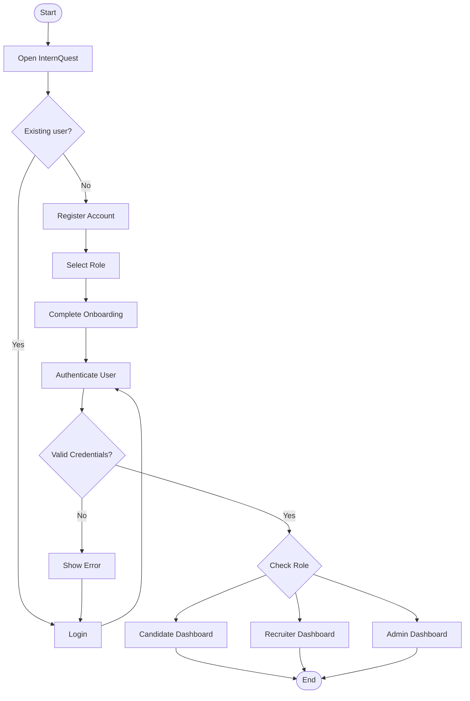
```mermaid
flowchart TD
    A([Start]) --> B[Open InternQuest]
    B --> C{Existing user?}
    C -- No --> D[Register Account]
    D --> E[Select Role]
    E --> F[Complete Onboarding]
    C -- Yes --> G[Login]
    F --> H[Authenticate User]
    G --> H
    H --> I{Valid Credentials?}
    I -- No --> J[Show Error]
    J --> G
    I -- Yes --> K{Check Role}
    K --> L[Candidate Dashboard]
    K --> M[Recruiter Dashboard]
    K --> N[Admin Dashboard]
    L --> O([End])
    M --> O
    N --> O
```

Use Case Diagram:
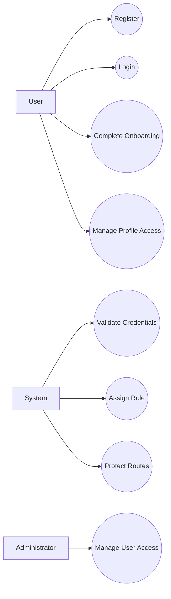
```mermaid
flowchart LR
    U[User] --> A((Register))
    U --> B((Login))
    U --> C((Complete Onboarding))
    U --> D((Manage Profile Access))
    S[System] --> E((Validate Credentials))
    S --> F((Assign Role))
    S --> G((Protect Routes))
    Admin[Administrator] --> H((Manage User Access))
```

ERD:
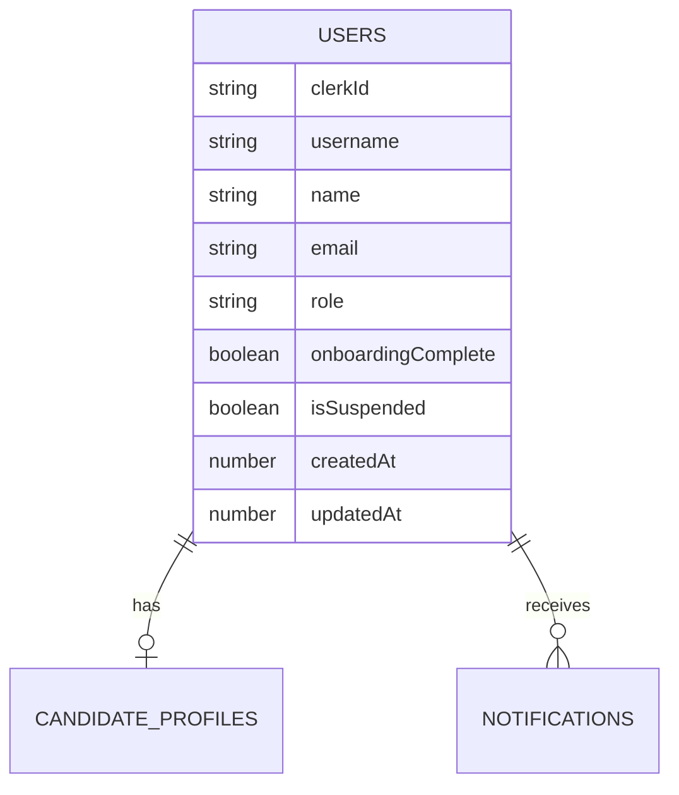
```mermaid
erDiagram
    USERS {
        string clerkId
        string username
        string name
        string email
        string role
        boolean onboardingComplete
        boolean isSuspended
        number createdAt
        number updatedAt
    }
    USERS ||--o| CANDIDATE_PROFILES : has
    USERS ||--o{ NOTIFICATIONS : receives
```

Class Diagram:
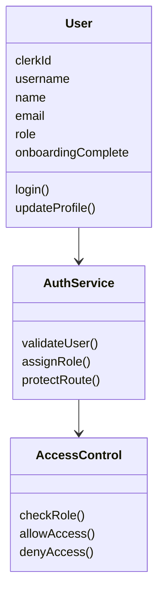
```mermaid
classDiagram
    class User {
        clerkId
        username
        name
        email
        role
        onboardingComplete
        login()
        updateProfile()
    }
    class AuthService {
        validateUser()
        assignRole()
        protectRoute()
    }
    class AccessControl {
        checkRole()
        allowAccess()
        denyAccess()
    }
    User --> AuthService
    AuthService --> AccessControl
```

Sequence Diagram:
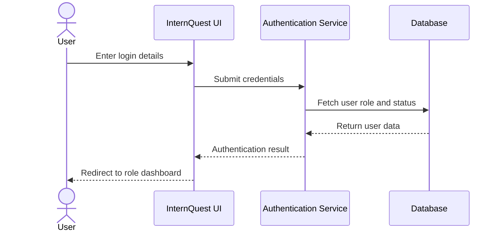
```mermaid
sequenceDiagram
    actor User
    participant UI as InternQuest UI
    participant Auth as Authentication Service
    participant DB as Database
    User->>UI: Enter login details
    UI->>Auth: Submit credentials
    Auth->>DB: Fetch user role and status
    DB-->>Auth: Return user data
    Auth-->>UI: Authentication result
    UI-->>User: Redirect to role dashboard
```

### 9.1.3 Testing

Testing should verify successful registration, login, onboarding, role assignment, protected route access, invalid login handling, and restricted access for unauthorized users.

## 9.2 Candidate Management Module

### 9.2.1 SRS

The Candidate Management Module allows candidates to create profiles, search and filter internships, submit applications, track application status, take assigned quizzes, and access learning resources.

Functional requirements:
- Candidates shall be able to create and update profiles.
- Candidates shall search, filter, and bookmark internship opportunities.
- Candidates shall submit internship applications with resumes and cover letters.
- Candidates shall track application status.
- Candidates shall take assigned quizzes and view results.
- Candidates shall access learning resources.

Non-functional requirements:
- Candidate workflows should be easy to use and responsive.
- Application submission should prevent duplicate applications.
- Candidate data and uploaded documents must remain secure.

### 9.2.2 Design and Modelling Diagrams

Activity Diagram:
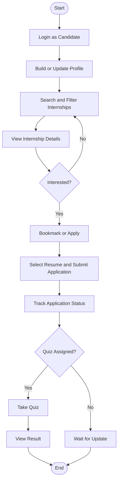
```mermaid
flowchart TD
    A([Start]) --> B[Login as Candidate]
    B --> C[Build or Update Profile]
    C --> D[Search and Filter Internships]
    D --> E[View Internship Details]
    E --> F{Interested?}
    F -- No --> D
    F -- Yes --> G[Bookmark or Apply]
    G --> H[Select Resume and Submit Application]
    H --> I[Track Application Status]
    I --> J{Quiz Assigned?}
    J -- Yes --> K[Take Quiz]
    K --> L[View Result]
    J -- No --> M[Wait for Update]
    L --> N([End])
    M --> N
```

Use Case Diagram:
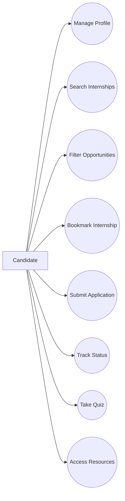
```mermaid
flowchart LR
    C[Candidate] --> A((Manage Profile))
    C --> B((Search Internships))
    C --> C1((Filter Opportunities))
    C --> D((Bookmark Internship))
    C --> E((Submit Application))
    C --> F((Track Status))
    C --> G((Take Quiz))
    C --> H((Access Resources))
```

ERD:
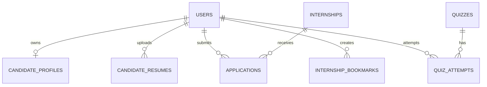
```mermaid
erDiagram
    USERS ||--o| CANDIDATE_PROFILES : owns
    USERS ||--o{ CANDIDATE_RESUMES : uploads
    USERS ||--o{ APPLICATIONS : submits
    USERS ||--o{ INTERNSHIP_BOOKMARKS : creates
    USERS ||--o{ QUIZ_ATTEMPTS : attempts
    INTERNSHIPS ||--o{ APPLICATIONS : receives
    QUIZZES ||--o{ QUIZ_ATTEMPTS : has
```

Class Diagram:
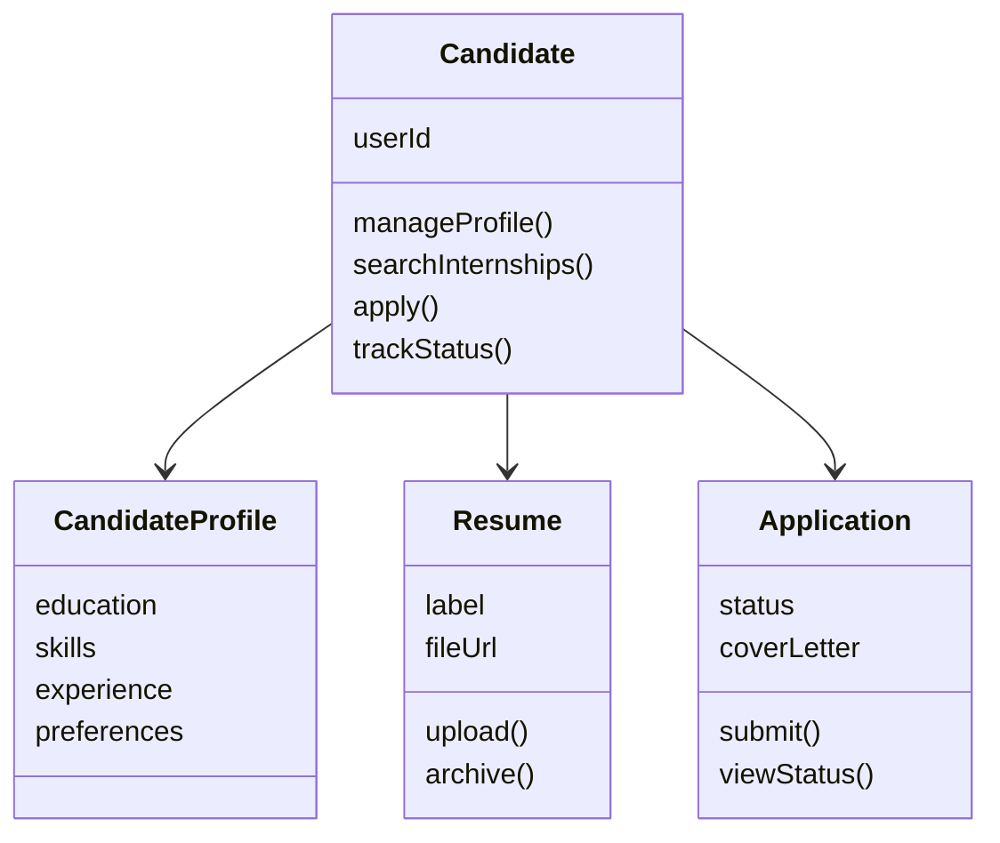
```mermaid
classDiagram
    class Candidate {
        userId
        manageProfile()
        searchInternships()
        apply()
        trackStatus()
    }
    class CandidateProfile {
        education
        skills
        experience
        preferences
    }
    class Resume {
        label
        fileUrl
        upload()
        archive()
    }
    class Application {
        status
        coverLetter
        submit()
        viewStatus()
    }
    Candidate --> CandidateProfile
    Candidate --> Resume
    Candidate --> Application
```

Sequence Diagram:
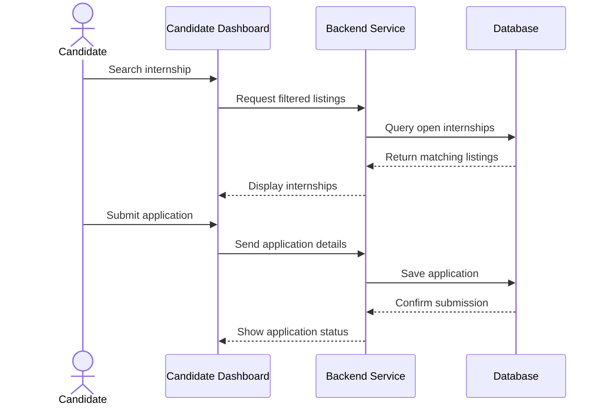
```mermaid
sequenceDiagram
    actor Candidate
    participant UI as Candidate Dashboard
    participant API as Backend Service
    participant DB as Database
    Candidate->>UI: Search internship
    UI->>API: Request filtered listings
    API->>DB: Query open internships
    DB-->>API: Return matching listings
    API-->>UI: Display internships
    Candidate->>UI: Submit application
    UI->>API: Send application details
    API->>DB: Save application
    DB-->>API: Confirm submission
    API-->>UI: Show application status
```

### 9.2.3 Testing

Testing should cover profile creation, profile update, internship search, filters, bookmarking, resume upload, application submission, duplicate application prevention, status tracking, quiz attempt, and resource access.

## 9.3 Recruiter Management Module

### 9.3.1 SRS

The Recruiter Management Module supports recruiters in creating internship listings, managing posted opportunities, reviewing applications, assigning quizzes, evaluating quiz results, and viewing recruitment analytics.

Functional requirements:
- Recruiters shall create, update, open, and close internship listings.
- Recruiters shall view applications submitted to their listings.
- Recruiters shall update candidate application statuses.
- Recruiters shall create and assign quizzes.
- Recruiters shall evaluate quiz results.
- Recruiters shall view recruitment analytics.

Non-functional requirements:
- Recruiters must only manage their own listings.
- Application review pages should load efficiently.
- Analytics should be clear and accurate.

### 9.3.2 Design and Modelling Diagrams

Activity Diagram:
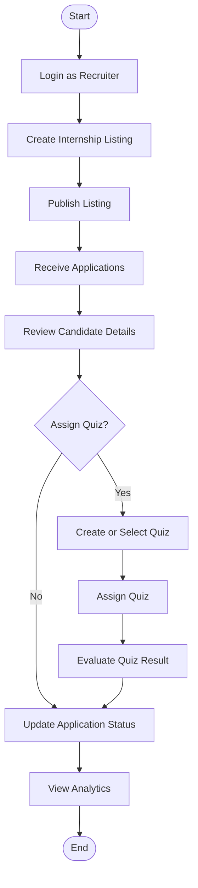
```mermaid
flowchart TD
    A([Start]) --> B[Login as Recruiter]
    B --> C[Create Internship Listing]
    C --> D[Publish Listing]
    D --> E[Receive Applications]
    E --> F[Review Candidate Details]
    F --> G{Assign Quiz?}
    G -- Yes --> H[Create or Select Quiz]
    H --> I[Assign Quiz]
    I --> J[Evaluate Quiz Result]
    G -- No --> K[Update Application Status]
    J --> K
    K --> L[View Analytics]
    L --> M([End])
```

Use Case Diagram:
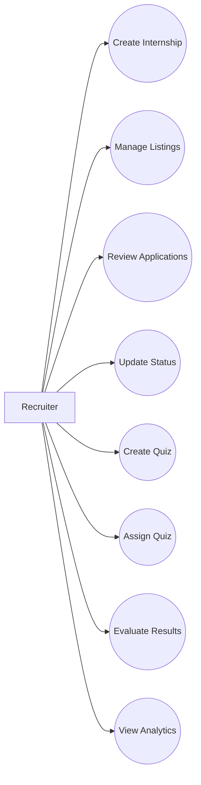
```mermaid
flowchart LR
    R[Recruiter] --> A((Create Internship))
    R --> B((Manage Listings))
    R --> C((Review Applications))
    R --> D((Update Status))
    R --> E((Create Quiz))
    R --> F((Assign Quiz))
    R --> G((Evaluate Results))
    R --> H((View Analytics))
```

ERD:
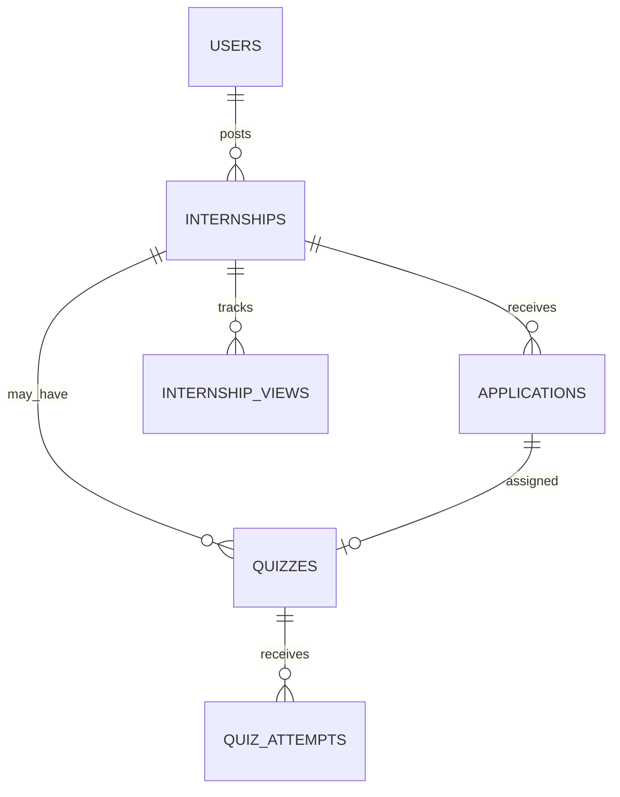
```mermaid
erDiagram
    USERS ||--o{ INTERNSHIPS : posts
    INTERNSHIPS ||--o{ APPLICATIONS : receives
    INTERNSHIPS ||--o{ INTERNSHIP_VIEWS : tracks
    INTERNSHIPS ||--o{ QUIZZES : may_have
    QUIZZES ||--o{ QUIZ_ATTEMPTS : receives
    APPLICATIONS ||--o| QUIZZES : assigned
```

Class Diagram:
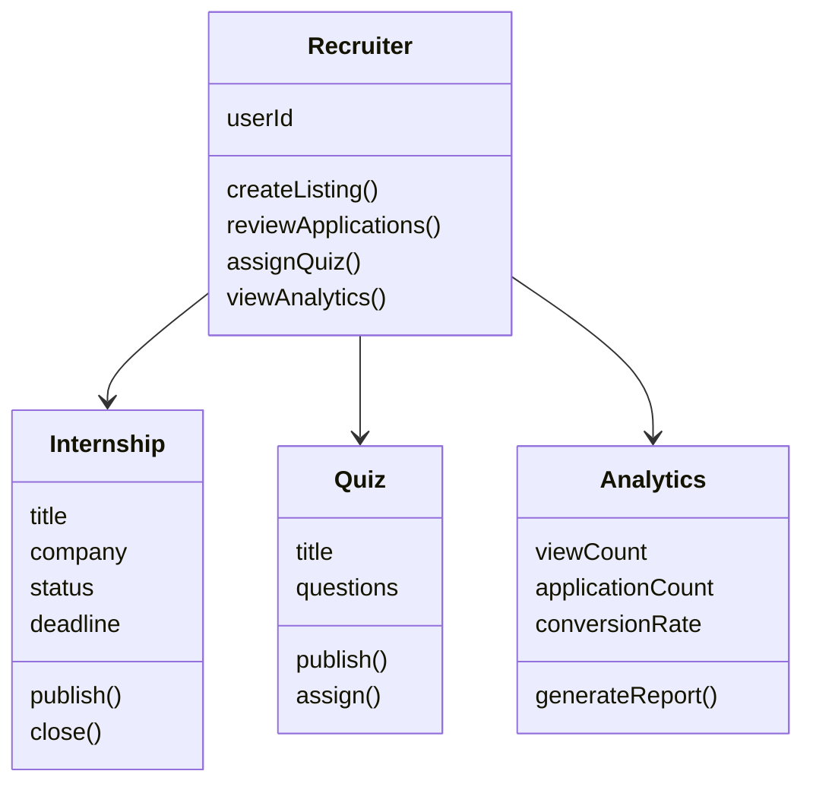
```mermaid
classDiagram
    class Recruiter {
        userId
        createListing()
        reviewApplications()
        assignQuiz()
        viewAnalytics()
    }
    class Internship {
        title
        company
        status
        deadline
        publish()
        close()
    }
    class Quiz {
        title
        questions
        publish()
        assign()
    }
    class Analytics {
        viewCount
        applicationCount
        conversionRate
        generateReport()
    }
    Recruiter --> Internship
    Recruiter --> Quiz
    Recruiter --> Analytics
```

Sequence Diagram:
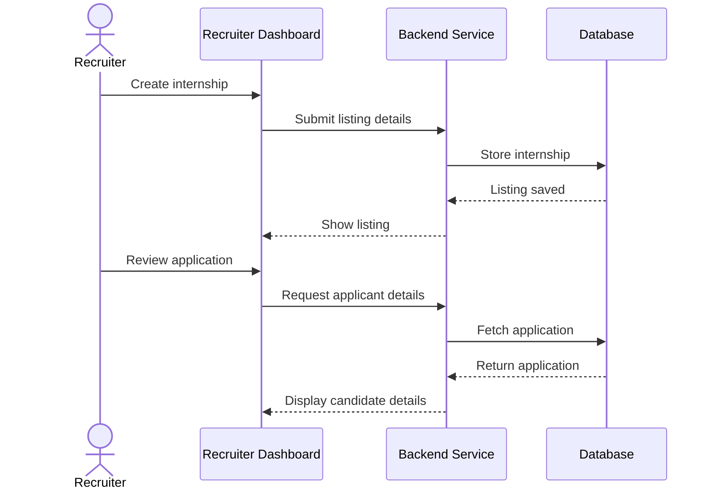
```mermaid
sequenceDiagram
    actor Recruiter
    participant UI as Recruiter Dashboard
    participant API as Backend Service
    participant DB as Database
    Recruiter->>UI: Create internship
    UI->>API: Submit listing details
    API->>DB: Store internship
    DB-->>API: Listing saved
    API-->>UI: Show listing
    Recruiter->>UI: Review application
    UI->>API: Request applicant details
    API->>DB: Fetch application
    DB-->>API: Return application
    API-->>UI: Display candidate details
```

### 9.3.3 Testing

Testing should verify internship creation, listing updates, status changes, recruiter ownership restrictions, application review, status updates, quiz creation, quiz assignment, result viewing, and analytics display.

## 9.4 Administrative Management Module

### 9.4.1 SRS

The Administrative Management Module allows administrators to manage users, moderate internship listings, review categories, publish resources, create sample quizzes, and review reports submitted by users.

Functional requirements:
- Administrators shall view and manage users.
- Administrators shall suspend or unsuspend accounts.
- Administrators shall moderate internship listings.
- Administrators shall approve or reject categories.
- Administrators shall manage blog/resource posts.
- Administrators shall create sample quizzes.
- Administrators shall review reports and take moderation actions.

Non-functional requirements:
- Admin actions must be secure and auditable.
- Moderation tools should be reliable and easy to operate.
- Admin-only features must not be accessible to other roles.

### 9.4.2 Design and Modelling Diagrams

Activity Diagram:
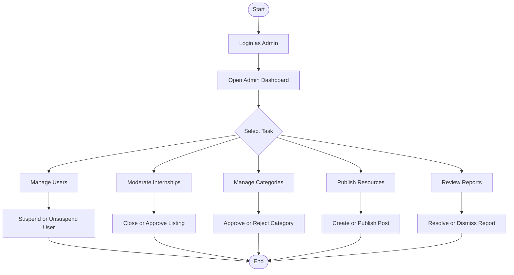
```mermaid
flowchart TD
    A([Start]) --> B[Login as Admin]
    B --> C[Open Admin Dashboard]
    C --> D{Select Task}
    D --> E[Manage Users]
    D --> F[Moderate Internships]
    D --> G[Manage Categories]
    D --> H[Publish Resources]
    D --> I[Review Reports]
    E --> J[Suspend or Unsuspend User]
    F --> K[Close or Approve Listing]
    G --> L[Approve or Reject Category]
    H --> M[Create or Publish Post]
    I --> N[Resolve or Dismiss Report]
    J --> O([End])
    K --> O
    L --> O
    M --> O
    N --> O
```

Use Case Diagram:
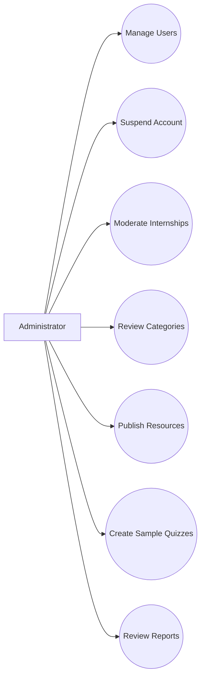
```mermaid
flowchart LR
    A[Administrator] --> B((Manage Users))
    A --> C((Suspend Account))
    A --> D((Moderate Internships))
    A --> E((Review Categories))
    A --> F((Publish Resources))
    A --> G((Create Sample Quizzes))
    A --> H((Review Reports))
```

ERD:
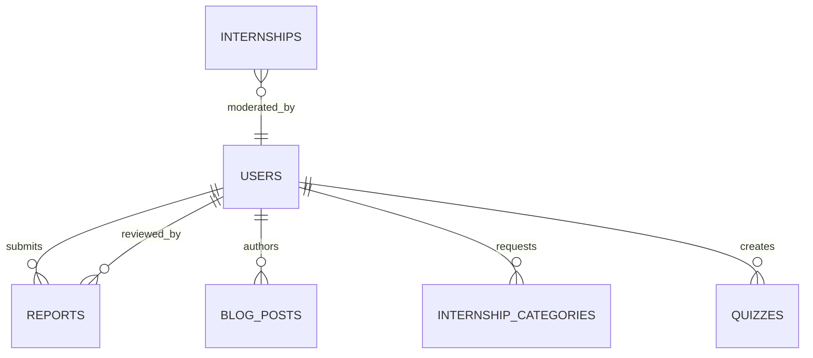
```mermaid
erDiagram
    USERS ||--o{ REPORTS : submits
    USERS ||--o{ BLOG_POSTS : authors
    USERS ||--o{ INTERNSHIP_CATEGORIES : requests
    USERS ||--o{ QUIZZES : creates
    REPORTS }o--|| USERS : reviewed_by
    INTERNSHIPS }o--|| USERS : moderated_by
```

Class Diagram:
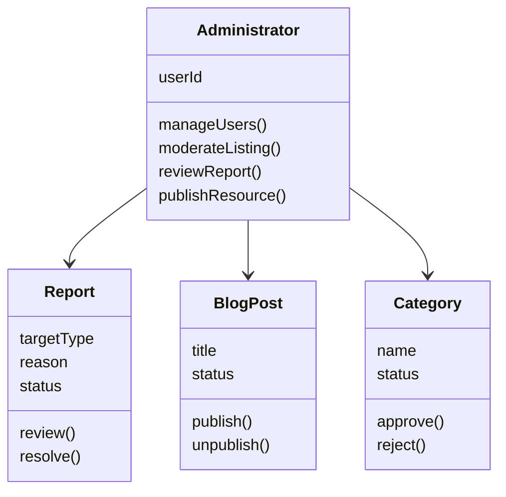
```mermaid
classDiagram
    class Administrator {
        userId
        manageUsers()
        moderateListing()
        reviewReport()
        publishResource()
    }
    class Report {
        targetType
        reason
        status
        review()
        resolve()
    }
    class BlogPost {
        title
        status
        publish()
        unpublish()
    }
    class Category {
        name
        status
        approve()
        reject()
    }
    Administrator --> Report
    Administrator --> BlogPost
    Administrator --> Category
```

Sequence Diagram:
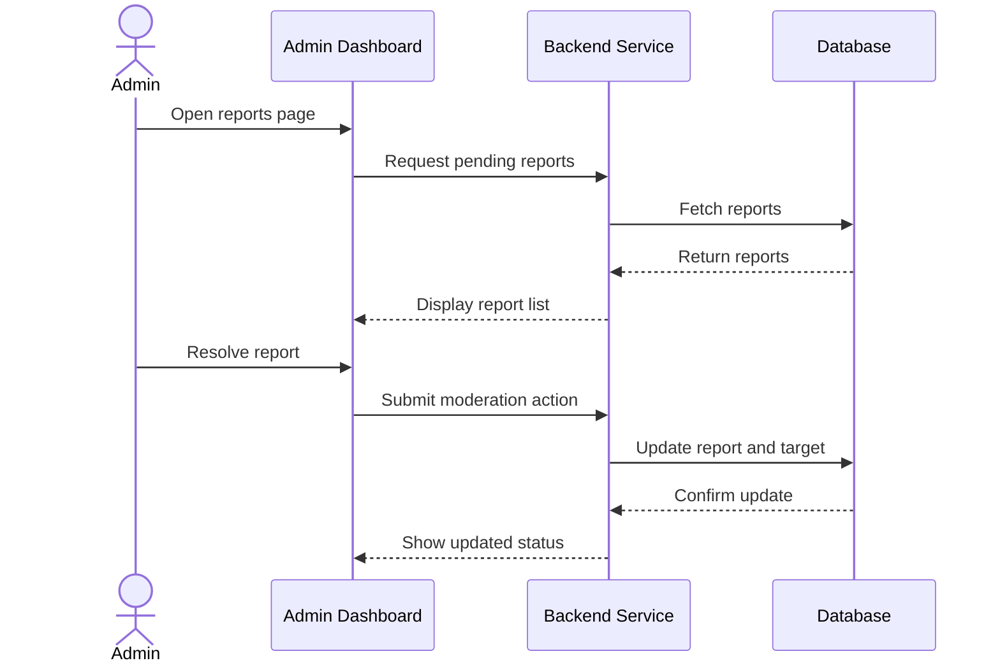
```mermaid
sequenceDiagram
    actor Admin
    participant UI as Admin Dashboard
    participant API as Backend Service
    participant DB as Database
    Admin->>UI: Open reports page
    UI->>API: Request pending reports
    API->>DB: Fetch reports
    DB-->>API: Return reports
    API-->>UI: Display report list
    Admin->>UI: Resolve report
    UI->>API: Submit moderation action
    API->>DB: Update report and target
    DB-->>API: Confirm update
    API-->>UI: Show updated status
```

### 9.4.3 Testing

Testing should cover user listing, user suspension, user unsuspension, internship moderation, category approval/rejection, blog/resource creation, quiz creation, report review, report resolution, and admin-only route protection.

## 9.5 Shared Platform Services

### 9.5.1 SRS

The Shared Platform Services subsystem provides common services used across InternQuest, including in-app notifications, email notifications, dashboard views, reporting and analytics, file storage, and content/data management.

Functional requirements:
- The system shall send in-app notifications for important events.
- The system shall send email notifications for application, quiz, resource, and internship updates.
- The system shall provide dashboard summaries for each role.
- The system shall track internship views and recruitment analytics.
- The system shall manage uploaded files and stored content.

Non-functional requirements:
- Notifications should be delivered reliably.
- Analytics should be accurate and updated.
- File access should be secure.
- Shared services should support all user roles consistently.

### 9.5.2 Design and Modelling Diagrams

Activity Diagram:
```mermaid
flowchart TD
    A([Start]) --> B[System Event Occurs]
    B --> C{Event Type}
    C --> D[Application Update]
    C --> E[Quiz Assignment]
    C --> F[New Internship]
    C --> G[New Resource]
    D --> H[Create Notification]
    E --> H
    F --> H
    G --> H
    H --> I[Send In-App Notification]
    H --> J[Send Email Notification]
    I --> K[Update Dashboard]
    J --> K
    K --> L([End])
```

Use Case Diagram:
```mermaid
flowchart LR
    C[Candidate] --> A((Receive Notifications))
    R[Recruiter] --> A
    AD[Administrator] --> A
    C --> B((View Dashboard))
    R --> B
    AD --> B
    R --> C1((View Analytics))
    AD --> D((Manage Content))
    S[System] --> E((Send Email))
    S --> F((Store Files))
```

ERD:
```mermaid
erDiagram
    USERS ||--o{ NOTIFICATIONS : receives
    USERS ||--o{ CANDIDATE_RESUMES : uploads
    INTERNSHIPS ||--o{ INTERNSHIP_VIEWS : records
    BLOG_POSTS }o--|| USERS : authored_by
    APPLICATIONS ||--o{ NOTIFICATIONS : triggers
    QUIZZES ||--o{ NOTIFICATIONS : triggers
```

Class Diagram:
```mermaid
classDiagram
    class NotificationService {
        createNotification()
        markAsRead()
        sendEmail()
    }
    class AnalyticsService {
        trackView()
        calculateMetrics()
        generateDashboard()
    }
    class StorageService {
        generateUploadUrl()
        getFileUrl()
        validateFile()
    }
    class ContentService {
        createPost()
        publishPost()
        manageData()
    }
    NotificationService --> AnalyticsService
    StorageService --> ContentService
```

Sequence Diagram:
```mermaid
sequenceDiagram
    participant Event as System Event
    participant Notify as Notification Service
    participant Email as Email Service
    participant DB as Database
    participant User as User Interface
    Event->>Notify: Trigger notification
    Notify->>DB: Store notification
    Notify->>Email: Send email alert
    Email-->>Notify: Delivery response
    User->>DB: Fetch unread notifications
    DB-->>User: Return notification list
```

### 9.5.3 Testing

Testing should verify in-app notification creation, unread notification count, mark-as-read behavior, email trigger actions, dashboard data loading, analytics calculation, file upload URL generation, file URL retrieval, and content/data consistency.
