# InternQuest Design and Modelling Diagrams - Mermaid Codes

## 9.1 User Authentication and Access Control

### Activity Diagram

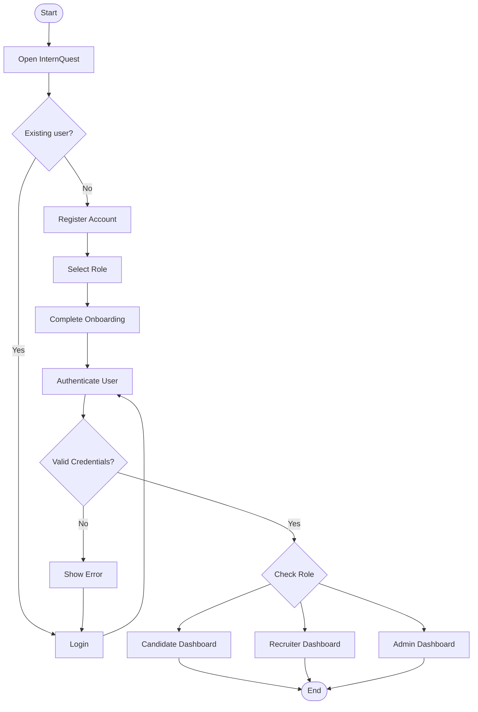

### Use Case Diagram

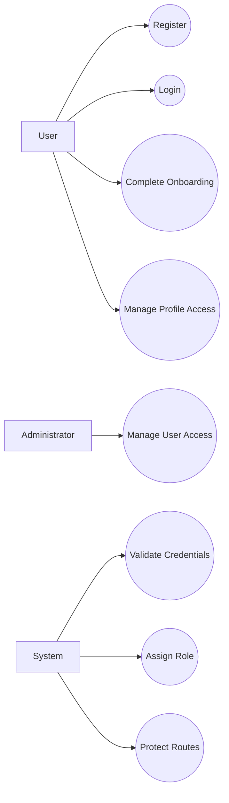

### ERD

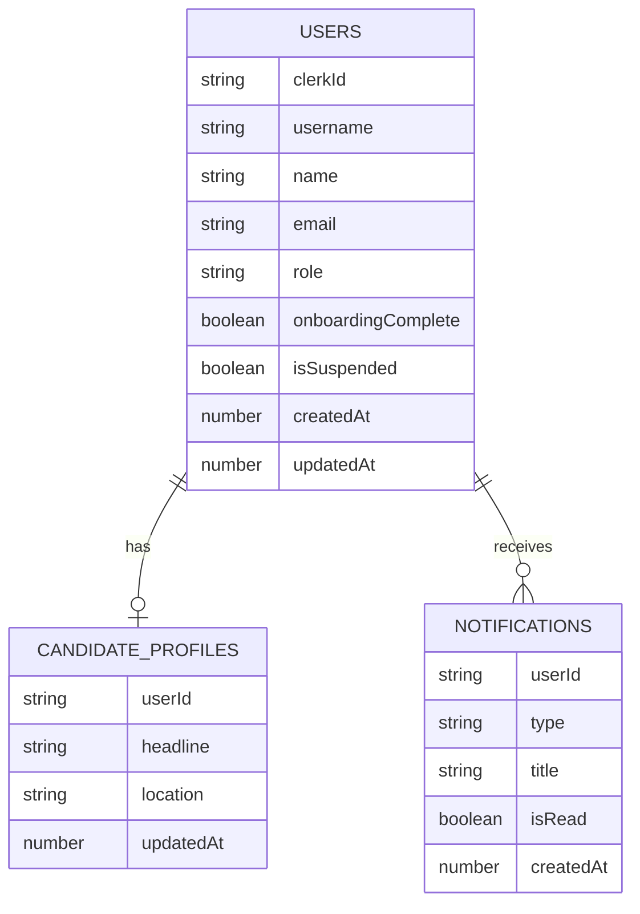

### Class Diagram

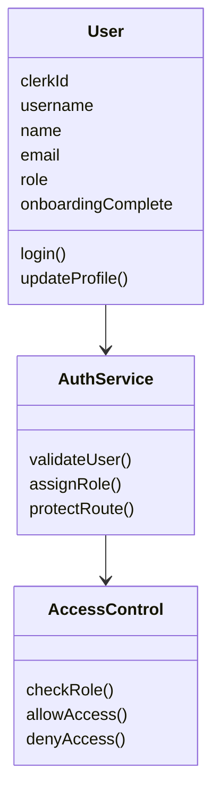

### Sequence Diagram

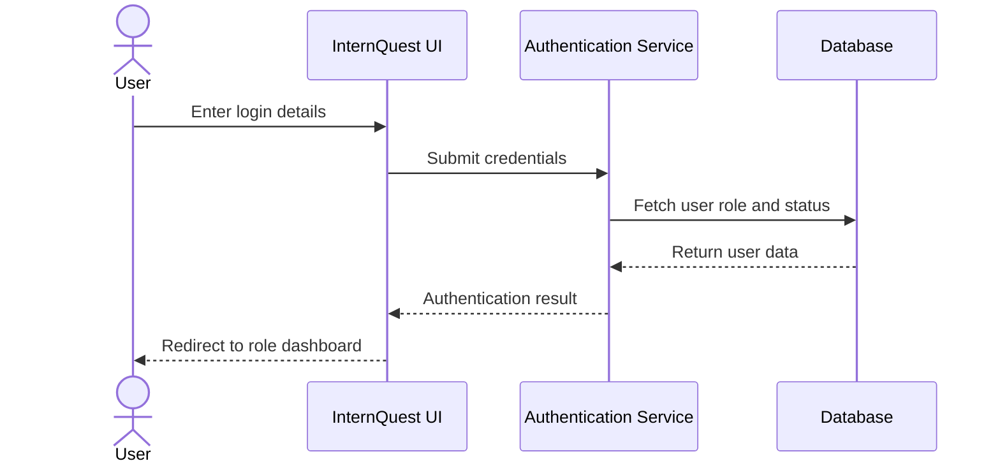

## 9.2 Candidate Management Module

### Activity Diagram

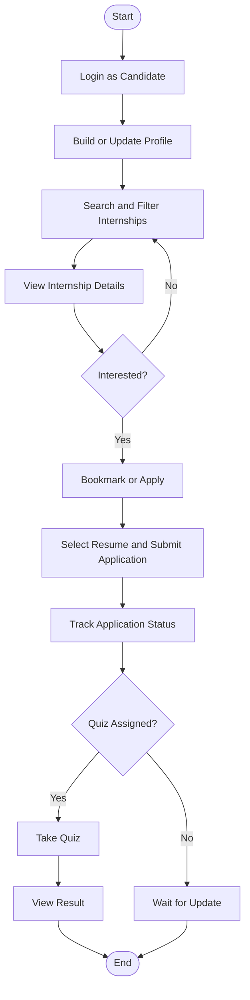

### Use Case Diagram

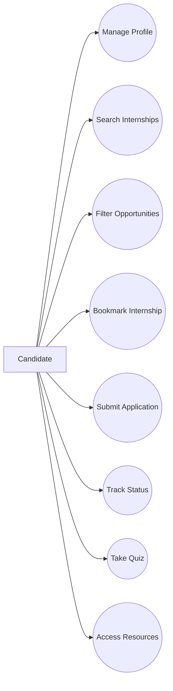

### ERD

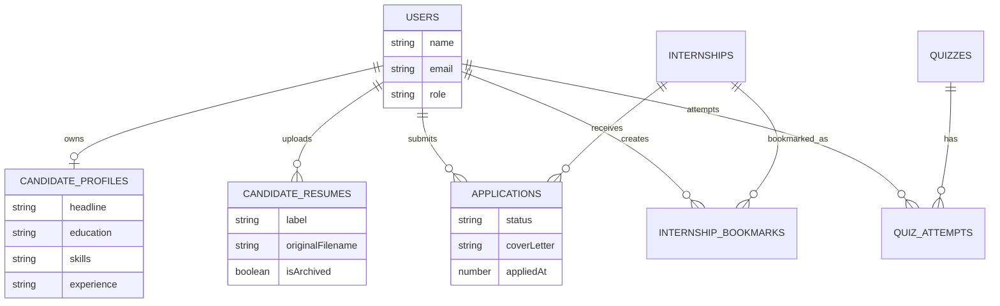

### Class Diagram

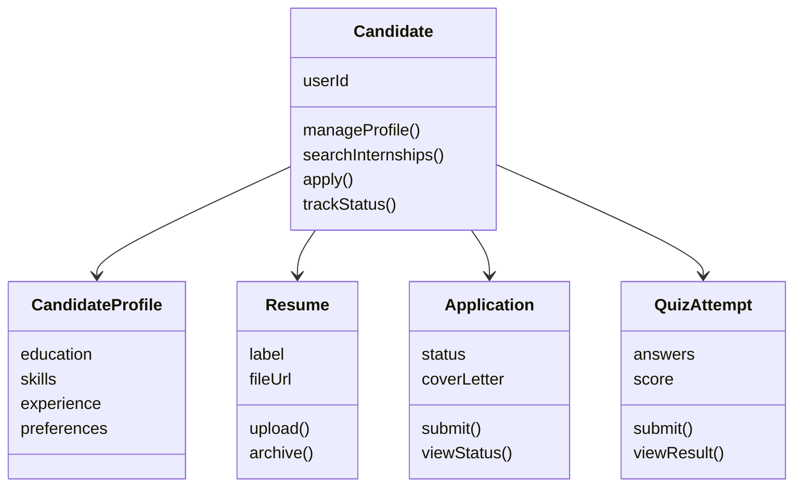

### Sequence Diagram

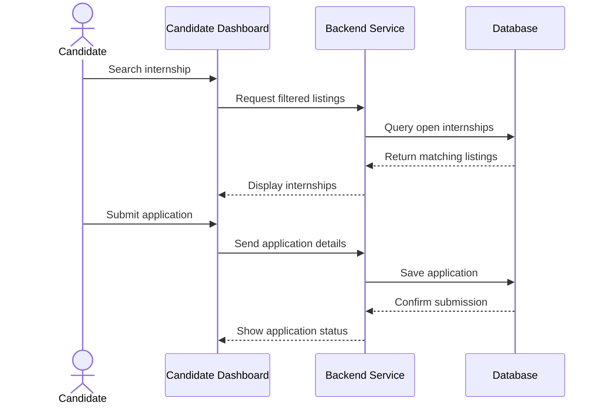

## 9.3 Recruiter Management Module

### Activity Diagram

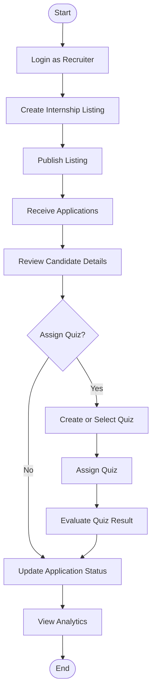

### Use Case Diagram

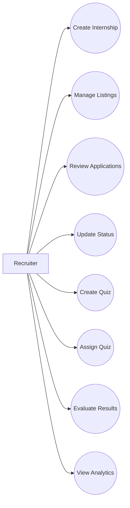

### ERD

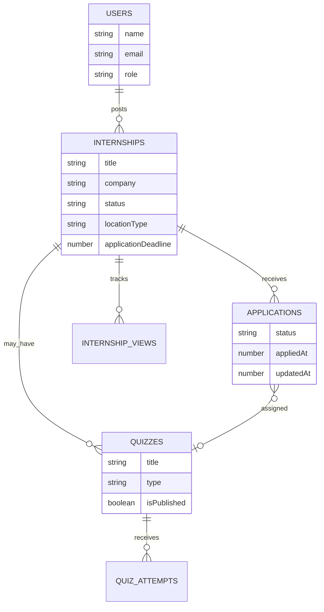

### Class Diagram

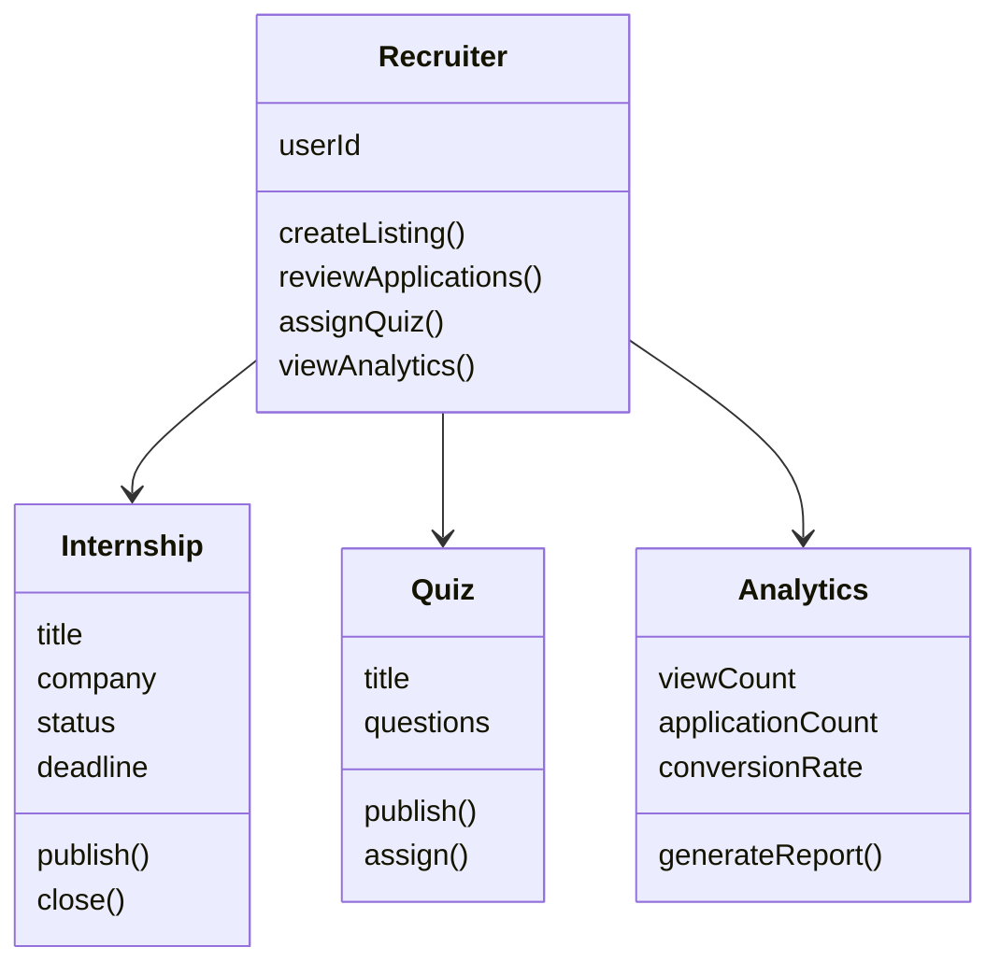

### Sequence Diagram

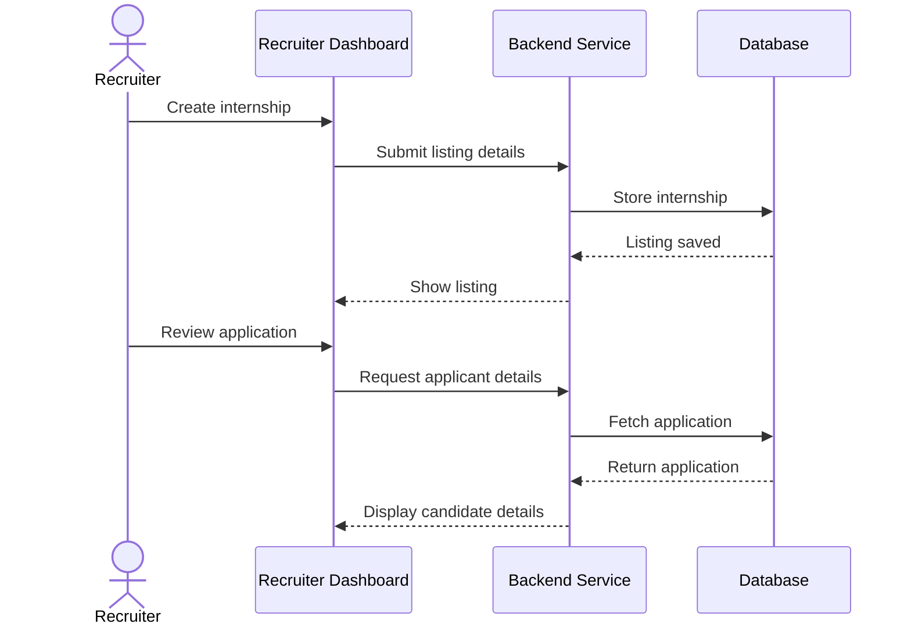

## 9.4 Administrative Management Module

### Activity Diagram

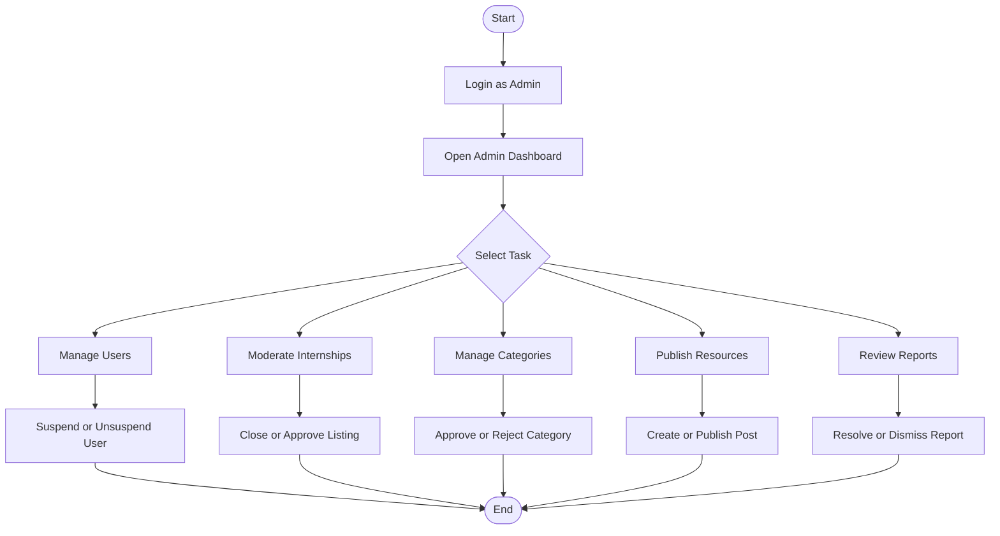

### Use Case Diagram

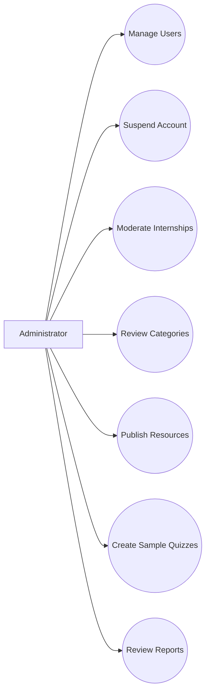

### ERD

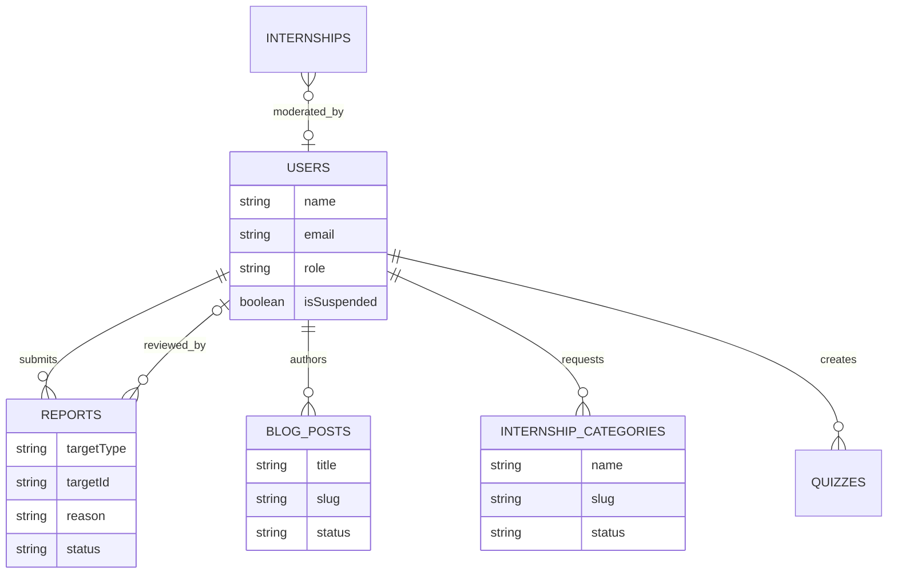

### Class Diagram

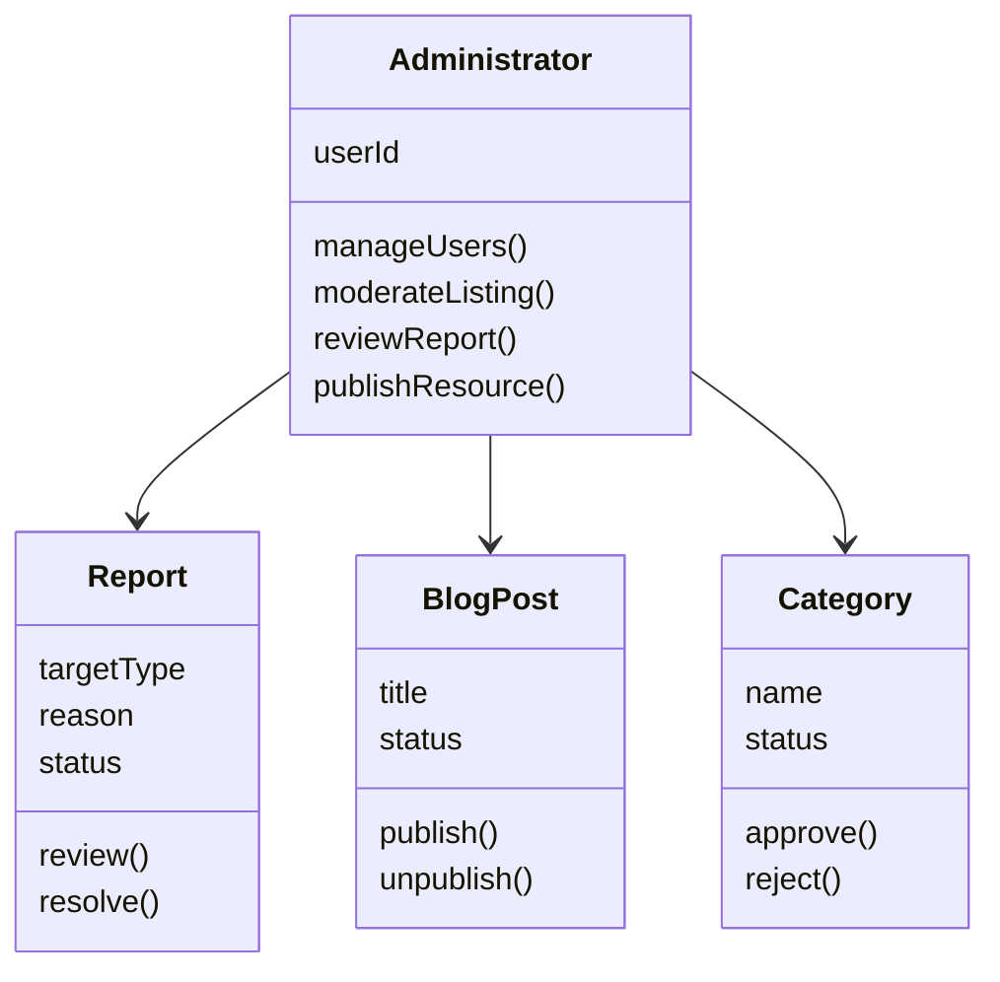

### Sequence Diagram

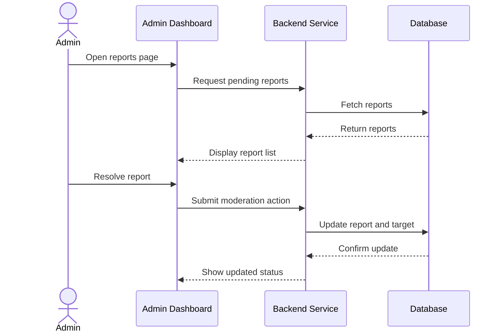

## 9.5 Shared Platform Services

### Activity Diagram

```mermaid
flowchart TD
    A([Start]) --> B[System Event Occurs]
    B --> C{Event Type}
    C --> D[Application Update]
    C --> E[Quiz Assignment]
    C --> F[New Internship]
    C --> G[New Resource]
    D --> H[Create Notification]
    E --> H
    F --> H
    G --> H
    H --> I[Send In-App Notification]
    H --> J[Send Email Notification]
    I --> K[Update Dashboard]
    J --> K
    K --> L([End])
```

### Use Case Diagram

```mermaid
flowchart LR
    Candidate[Candidate]
    Recruiter[Recruiter]
    Admin[Administrator]
    System[System]

    Candidate --> ReceiveNotifications((Receive Notifications))
    Recruiter --> ReceiveNotifications
    Admin --> ReceiveNotifications

    Candidate --> ViewDashboard((View Dashboard))
    Recruiter --> ViewDashboard
    Admin --> ViewDashboard

    Recruiter --> ViewAnalytics((View Analytics))
    Admin --> ManageContent((Manage Content))

    System --> SendEmail((Send Email))
    System --> StoreFiles((Store Files))
```

### ERD

```mermaid
erDiagram
    USERS ||--o{ NOTIFICATIONS : receives
    USERS ||--o{ CANDIDATE_RESUMES : uploads
    INTERNSHIPS ||--o{ INTERNSHIP_VIEWS : records
    BLOG_POSTS }o--|| USERS : authored_by
    APPLICATIONS ||--o{ NOTIFICATIONS : triggers
    QUIZZES ||--o{ NOTIFICATIONS : triggers

    NOTIFICATIONS {
        string type
        string title
        string message
        boolean isRead
    }

    INTERNSHIP_VIEWS {
        string viewerKey
        number viewedAt
    }

    CANDIDATE_RESUMES {
        string label
        string originalFilename
        boolean isArchived
    }
```

### Class Diagram

```mermaid
classDiagram
    class NotificationService {
        createNotification()
        markAsRead()
        sendEmail()
    }

    class AnalyticsService {
        trackView()
        calculateMetrics()
        generateDashboard()
    }

    class StorageService {
        generateUploadUrl()
        getFileUrl()
        validateFile()
    }

    class ContentService {
        createPost()
        publishPost()
        manageData()
    }

    NotificationService --> AnalyticsService
    StorageService --> ContentService
```

### Sequence Diagram

```mermaid
sequenceDiagram
    participant Event as System Event
    participant Notify as Notification Service
    participant Email as Email Service
    participant DB as Database
    participant User as User Interface

    Event->>Notify: Trigger notification
    Notify->>DB: Store notification
    Notify->>Email: Send email alert
    Email-->>Notify: Delivery response
    User->>DB: Fetch unread notifications
    DB-->>User: Return notification list
```
