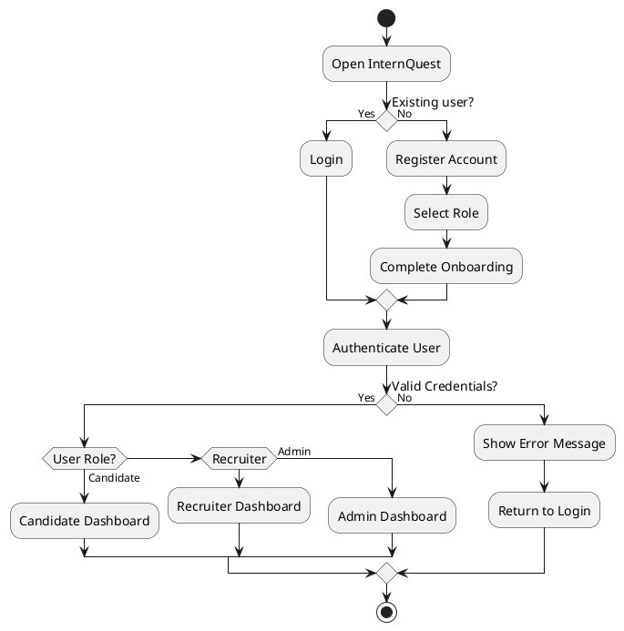
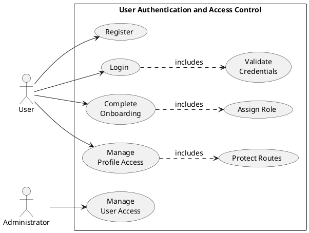
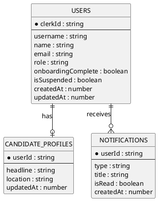
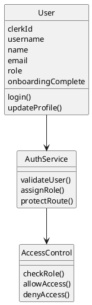
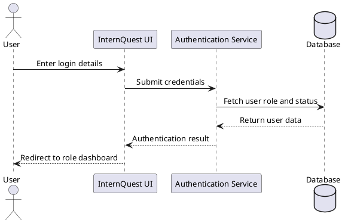

# InternQuest PlantUML Codes - Clean Report Version

Use these versions if the original diagrams show spacing, overlap, or icon issues. These snippets remove entity/class icons, use Arial, reduce font size, and improve layout consistency.

## 9.1 User Authentication and Access Control

### Activity Diagram



### Use Case Diagram



### ERD



### Class Diagram



### Sequence Diagram



## Reusable Fixes

Add these lines near the top of any PlantUML diagram if text appears too spaced out or overlaps:

```plantuml
skinparam defaultFontName Arial
skinparam defaultFontSize 13
skinparam classAttributeIconSize 0
hide circle
```

For ERD and class diagrams, `hide circle` removes the green `E` or `C` icon that can overlap with the title. For class diagrams, `classAttributeIconSize 0` removes small attribute icons that can disturb spacing.
