# InternQuest PlantUML Diagram Previews

This file uses the original PlantUML codes from `modelling-diagrams-plantuml.md`.
Each preview is rendered through the public PlantUML server URL.

## 9.1 User Authentication and Access Control

### Activity Diagram


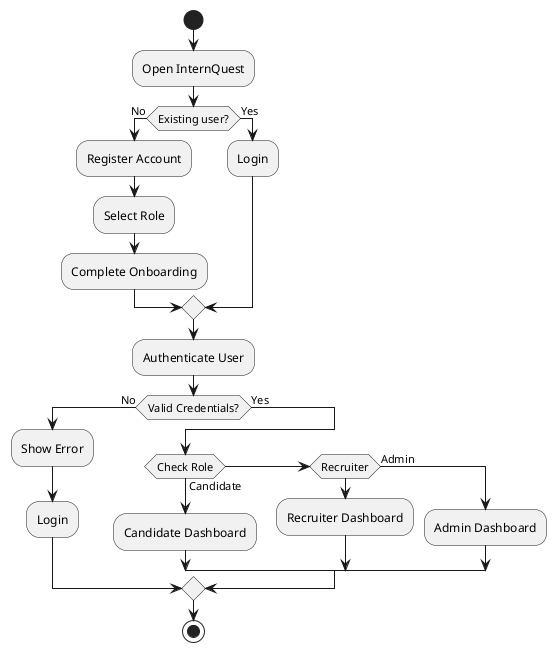

### Use Case Diagram


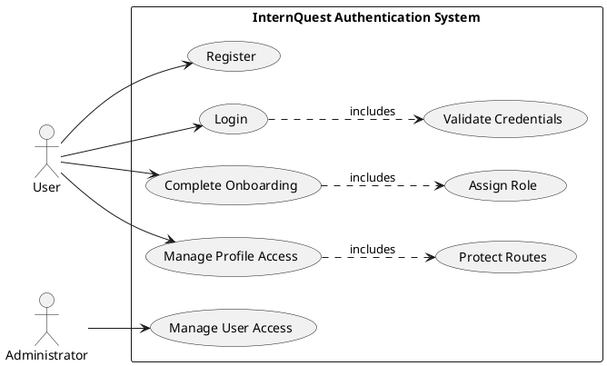

### ERD


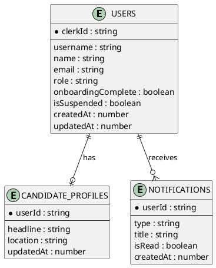

### Class Diagram


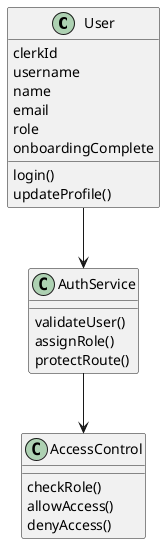

### Sequence Diagram


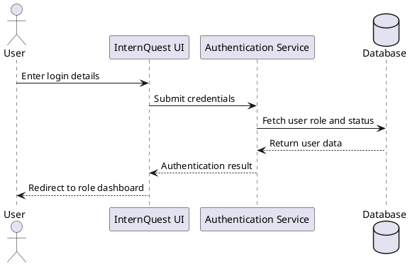

## 9.2 Candidate Management Module

### Activity Diagram


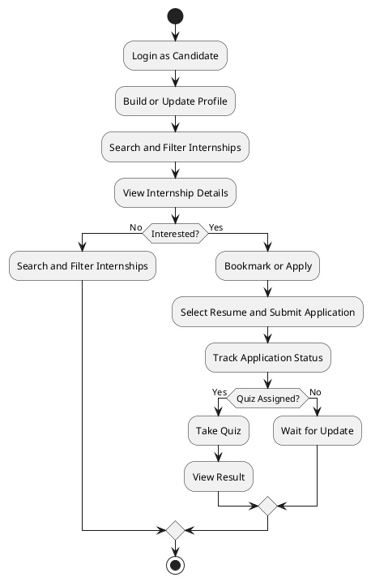

### Use Case Diagram


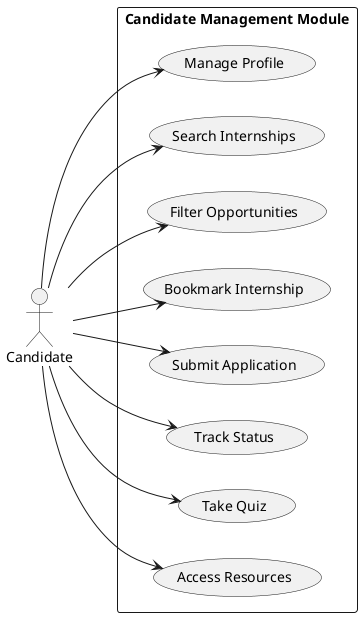

### ERD


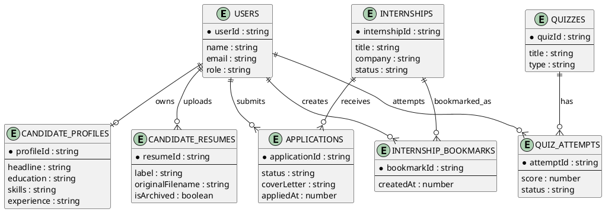

### Class Diagram


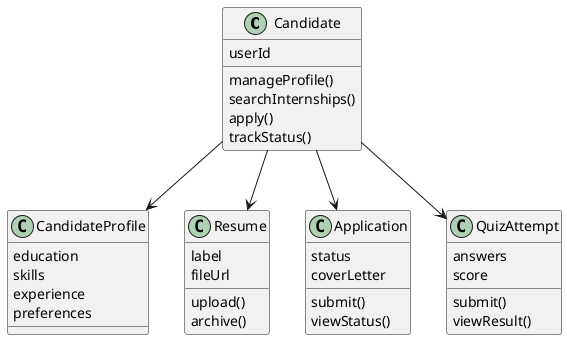

### Sequence Diagram


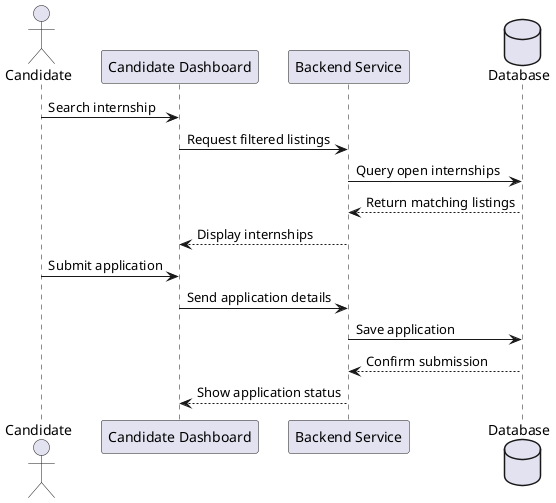

## 9.3 Recruiter Management Module

### Activity Diagram


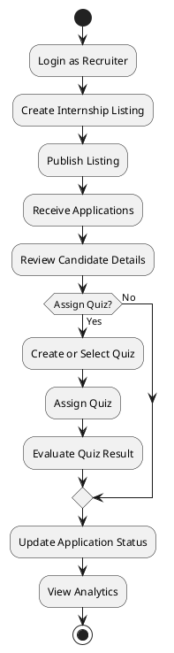

### Use Case Diagram


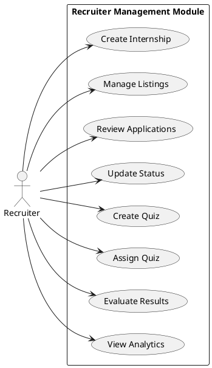

### ERD


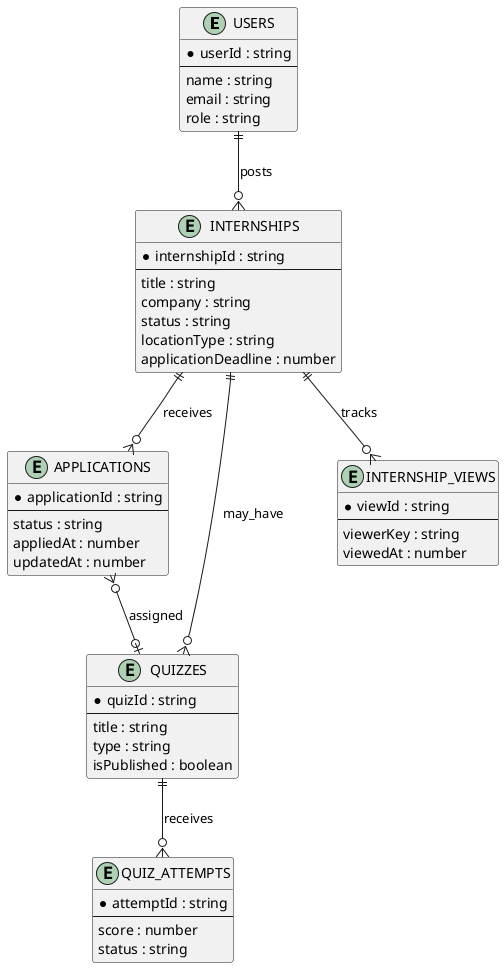

### Class Diagram


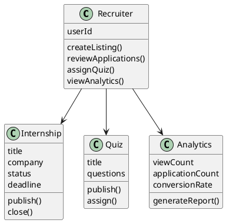

### Sequence Diagram


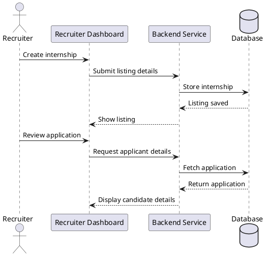

## 9.4 Administrative Management Module

### Activity Diagram


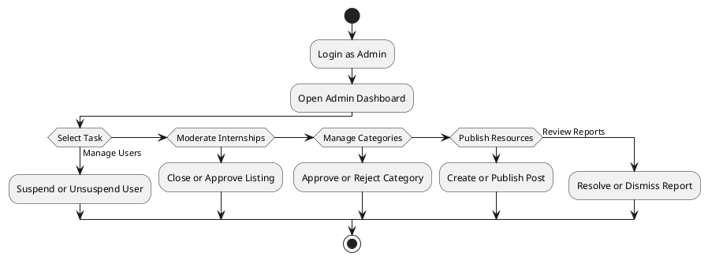

### Use Case Diagram


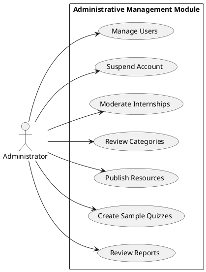

### ERD


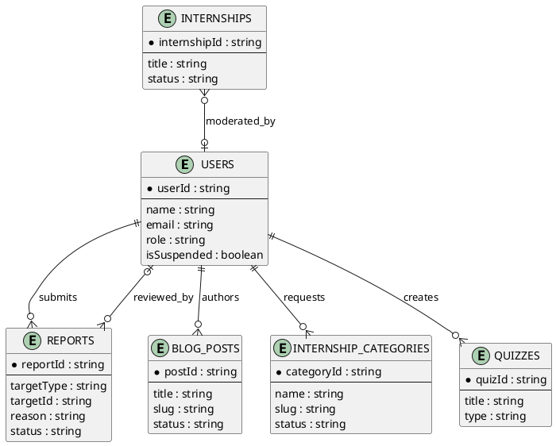

### Class Diagram


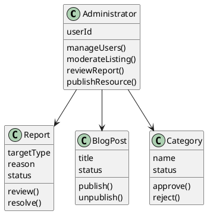

### Sequence Diagram


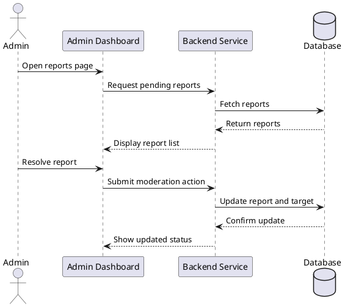

## 9.5 Shared Platform Services

### Activity Diagram


```plantuml
@startuml
start
:System Event Occurs;
if (Event Type) then (Application Update)
  :Create Notification;
elseif (Quiz Assignment)
  :Create Notification;
elseif (New Internship)
  :Create Notification;
else (New Resource)
  :Create Notification;
endif
:Send In-App Notification;
:Send Email Notification;
:Update Dashboard;
stop
@enduml
```

### Use Case Diagram


```plantuml
@startuml
left to right direction
actor Candidate
actor Recruiter
actor Administrator
actor System

rectangle "Shared Platform Services" {
  usecase "Receive Notifications" as UC1
  usecase "View Dashboard" as UC2
  usecase "View Analytics" as UC3
  usecase "Manage Content" as UC4
  usecase "Send Email" as UC5
  usecase "Store Files" as UC6
}

Candidate --> UC1
Recruiter --> UC1
Administrator --> UC1
Candidate --> UC2
Recruiter --> UC2
Administrator --> UC2
Recruiter --> UC3
Administrator --> UC4
System --> UC5
System --> UC6
@enduml
```

### ERD


```plantuml
@startuml
entity USERS {
  * userId : string
  --
  name : string
  email : string
  role : string
}

entity NOTIFICATIONS {
  * notificationId : string
  --
  type : string
  title : string
  message : string
  isRead : boolean
}

entity CANDIDATE_RESUMES {
  * resumeId : string
  --
  label : string
  originalFilename : string
  isArchived : boolean
}

entity INTERNSHIPS {
  * internshipId : string
  --
  title : string
  status : string
}

entity INTERNSHIP_VIEWS {
  * viewId : string
  --
  viewerKey : string
  viewedAt : number
}

entity BLOG_POSTS {
  * postId : string
  --
  title : string
  status : string
}

entity APPLICATIONS {
  * applicationId : string
  --
  status : string
}

entity QUIZZES {
  * quizId : string
  --
  title : string
}

USERS ||--o{ NOTIFICATIONS : receives
USERS ||--o{ CANDIDATE_RESUMES : uploads
INTERNSHIPS ||--o{ INTERNSHIP_VIEWS : records
BLOG_POSTS }o--|| USERS : authored_by
APPLICATIONS ||--o{ NOTIFICATIONS : triggers
QUIZZES ||--o{ NOTIFICATIONS : triggers
@enduml
```

### Class Diagram


```plantuml
@startuml
class NotificationService {
  createNotification()
  markAsRead()
  sendEmail()
}

class AnalyticsService {
  trackView()
  calculateMetrics()
  generateDashboard()
}

class StorageService {
  generateUploadUrl()
  getFileUrl()
  validateFile()
}

class ContentService {
  createPost()
  publishPost()
  manageData()
}

NotificationService --> AnalyticsService
StorageService --> ContentService
@enduml
```

### Sequence Diagram


```plantuml
@startuml
participant "System Event" as Event
participant "Notification Service" as Notify
participant "Email Service" as Email
database "Database" as DB
participant "User Interface" as User

Event -> Notify : Trigger notification
Notify -> DB : Store notification
Notify -> Email : Send email alert
Email --> Notify : Delivery response
User -> DB : Fetch unread notifications
DB --> User : Return notification list
@enduml
```
